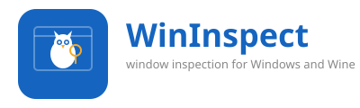

# WinInspect

<p align="center">
  
</p>
<p align="center">
  <b>Window inspection for Windows and Wine</b><br>
  <i>Strix the Window Owl inspects Windows and Wine desktops on your behalf.</i>
</p>

<p align="center">
  <a href="https://github.com/sponsors/mark-e-deyoung"></a>
  <a href="https://ko-fi.com/peaceactivist"></a>
</p>

## About

WinInspect is a remote Windows desktop inspection and automation daemon.
It provides programmatic access to window hierarchies, screen capture,
input injection, process management, clipboard, and registry — on both
**Windows 10/11** and **Wine 10/11/12**.

The system is designed as a **core + broker + clients** architecture:

- **Core** (`libwininspect_core`) is deterministic, concurrency-safe, and idempotent.
- **Broker/Daemon** (`wininspectd.exe`) exposes a local IPC API (Windows Named Pipes).
- **Clients**: CLI, Win32 native GUI, and API clients can run **concurrently** without interfering.

This repository is scaffolded to follow the **WineBotAppBuilder (WBAB)** lifecycle:
- `wbab lint`
- `wbab build`
- `wbab test`
- `wbab package`
- `wbab sign`
- `wbab smoke`
- `wbab discover`

## Download

Pre-built releases are available on the [GitHub Releases page](https://github.com/SemperSupra/WinInspect/releases).

| Package | Description |
|---|---|
| `WinInspect-Installer-*.exe` | NSIS installer for Windows 10/11 and Wine 10.x/11.x |
| `WinInspectPortable-*.zip` | Portable edition — extract anywhere, no installation |
| `wi-portable-*-win-x64.exe` | Go portable CLI (Windows) |
| `wi-portable-*-linux-x64` | Go portable CLI (Linux) |

> **⚠️ Don't mix deployment methods.** Pick one and stick with it. Installing via winget then trying to update via Chocolatey (or replacing a package-manager install with the portable ZIP) will leave behind stale registry entries, duplicate binaries, and broken shortcuts. If you want to switch, uninstall the old version first.

Release builds are code-signed through the **SignPath Foundation**.
Checksums (SHA256) are provided for all artifacts.

## Quick start (developer)

### Prerequisites

Install the toolchain via winget (Windows 10/11 built-in):

```powershell
# One-time setup
winget install Kitware.CMake
winget install Microsoft.VisualStudio.2022.BuildTools `
  --override "--wait --quiet --add Microsoft.VisualStudio.Workload.VCTools --includeRecommended"
winget install GoLang.Go              # for portable CLI
winget install NSIS.NSIS              # for installer packaging
```

Verify the toolchain:

```powershell
cmake --version          # >= 3.22
where cl                 # MSVC compiler
go version               # >= 1.21 (optional)
makensis /VERSION        # NSIS (optional)
```

### Build + test

```powershell
cmake -S . -B build -DWININSPECT_BUILD_TESTS=ON
cmake --build build --config Release
ctest --test-dir build -C Release --output-on-failure
```

### Run daemon + CLI (Windows)

```powershell
build\Release\wininspectd.exe
build\Release\wininspect.exe top
build\Release\wininspect.exe capabilities
build\Release\wininspect.exe check-update
```

### Package installer (optional)

```powershell
cmake --build build --config Release
makensis -DVERSION=dev -DBUILD_SRC=build\Release -DDIST_DIR=dist tools\wininspect.nsi
```

### Linux / WSL (cross-compile for Wine)

```bash
sudo apt install cmake mingw-w64 wine
cmake -S . -B build \
  -DCMAKE_SYSTEM_NAME=Windows \
  -DCMAKE_C_COMPILER=x86_64-w64-mingw32-gcc \
  -DCMAKE_CXX_COMPILER=x86_64-w64-mingw32-g++ \
  -DCMAKE_CROSSCOMPILING_EMULATOR=/usr/bin/wine \
  -DWININSPECT_BUILD_TESTS=ON
cmake --build build
```

## Submodule Policy

This project follows a **Submodule Co-Evolution Policy**.
- Submodules may be modified locally for development and testing.
- **Pushes to upstream submodule repositories are strictly forbidden.**
- Upstream synchronization happens via issues and patches.

For full details, see [docs/SUBMODULE_POLICY.md](docs/SUBMODULE_POLICY.md).

To ensure your local guardrails are active, run:
```bash
./scripts/submodules/enforce-policy.sh
```

## Architecture
See:
- `docs/ARCHITECTURE.md`
- `docs/PROTOCOL.md`
- `docs/CONTRACTS.md`
- `formal/tla/`

## Privacy

WinInspect does not collect, transmit, or store personal data. See
[PRIVACY.md](PRIVACY.md) for the full privacy policy.

## License

**Source-Available: PolyForm Noncommercial License + Commercial License**

WinInspect is source-available under the
[PolyForm Noncommercial License 1.0.0](LICENSE).

- **Personal / hobby / educational use:** Free. Audit the source, learn
  from it, use it for personal projects.
- **Internal company use: NOT free.** Companies must purchase a
  [commercial license](COMMERCIAL_LICENSE.md).
- **Commercial resale / embedding:** Requires a commercial license.

See `LICENSE` for the full license text and
[COMMERCIAL_LICENSE.md](COMMERCIAL_LICENSE.md) to purchase a license.
